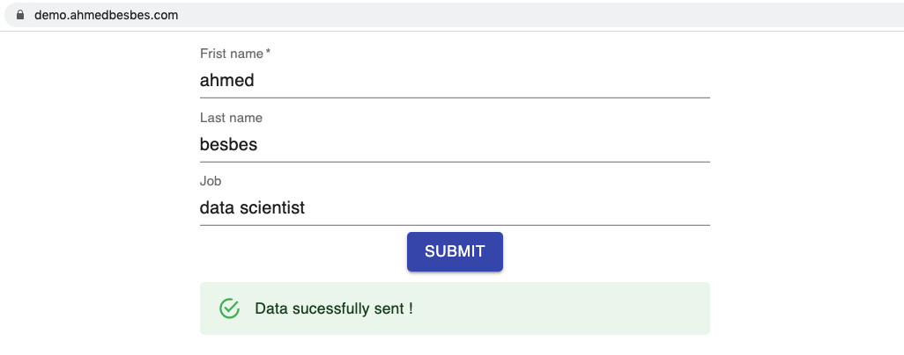

## Deploy your Secure React App with Docker and Nginx

    

This is the code for this <a href="">article</a>.

### Description

This is a boilerplate code I played with to learn about Docker and deployment.

It covers:

- Building a simple React front-end using the Material-UI library
- Designing a Flask API that receives data from the front-end
- Setting up a domain name and an SSL certificate with Nginx

### Screenshot of the app

    

